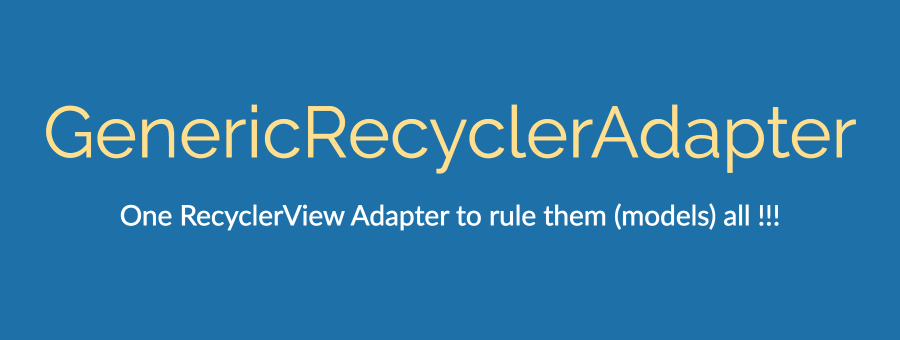

# GenericRecyclerAdapter

[](https://jitpack.io/#in.championswimmer/GenericRecyclerAdapter)

<a href='https://play.google.com/store/apps/details?id=in.championswimmer.genericrecycleradapter.sample&pcampaignid=MKT-Other-global-all-co-prtnr-py-PartBadge-Mar2515-1'>
    
</a>




## Motivation

Consuming a CRUD REST API and showing 20 different models in RecyclerViews ?
Tired of creating separate RecyclerView.Adapter classes for each model ?

Have a lot of models and list_item_layout files ?

**_GenericRecyclerAdapter_** is here to help you.
Pass the model type and layout id in the constructor
and let us do the magic for you.

## Usage
Given a class `Post` that defines the model,
an `Array` of `Post` called `posts`
and a layout `list_item_post.xml`, we can
use the GenericRecyclerView as follows -

### Java

```java

ArrayList<Post> posts = Post.genPosts(100);
RecyclerView rvPosts;

rvPosts = findViewById(R.id.rvPosts);
rvPosts.setLayoutManager(new LinearLayoutManager(this));
rvPosts.setAdapter(new GenericRecyclerAdapter<Post>(
        posts,
        R.layout.list_item_post,
        new GenericRecyclerAdapter.OnItemBindListener<Post>() {
            @Override
            public void onBind(View itemView, Post item) {
                ((TextView) itemView.findViewById(R.id.tvTitle))
                        .setText(item.getTitle());
                ((TextView) itemView.findViewById(R.id.tvBody))
                        .setText(item.getBody());
            }
        }
));

```

### Kotlin

```kotlin
var posts = genPosts(100) 
rvPosts.apply {
    layoutManager = LinearLayoutManager(this@KotlinActivity)
    adapter = GenericRecyclerAdapter<Post>(
            posts,
            R.layout.list_item_post,
            {
                itemView, item -> itemView.apply { with (item) {

                tvTitle.text = title
                tvBody.text = body

            } } }
    )
}
```


## Installation

Add to your root `build.gradle`

```groovy
	allprojects {
		repositories {
			...
			maven { url 'https://jitpack.io' }
		}
	}
```

Add to your app's `build.gradle`

```groovy
	dependencies {
	        compile 'in.championswimmer:GenericRecyclerAdapter:0.1.5'
	}

```